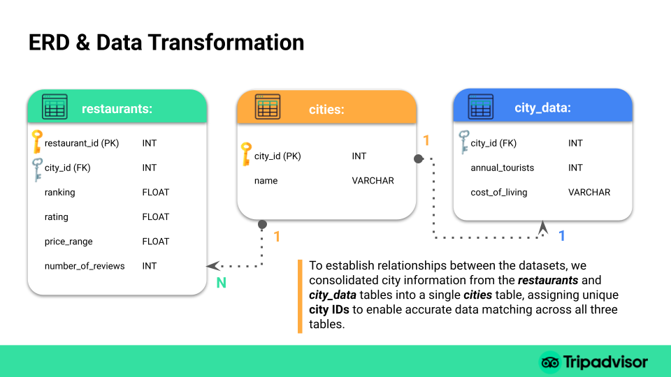

# How Tourism Shapes Dining: Insights from European Cities 
## Mini Project - SQL: From Data to Insight

Two data sources were used to complement restaurant data with tourism and economic insights. The data was normalized into a relational MySQL database, and analytical SQL queries were run, with findings visualized in a Jupyter Notebook report.


## Research Hypothesis

1. **Cities with higher annual tourist arrivals tend to have more reviews.**
2. **Cities with a higher cost of living generally have restaurants with higher price levels.**

## Key Findings

- Strong Positive Correlation ($r = 0.76$): There is a powerful link between tourist arrivals and review volume; as a city's "fame" grows, its digital footprint follows.
- The "58% Rule" ($R^2 = 0.58$): Over half (58%) of a city's total restaurant reviews are driven strictly by the volume of tourist arrivals.
- The "99% Certainty" on Price: ANOVA testing confirmed that Cost of Living is a statistically significant predictor of restaurant prices ($p = 0.0025$).
- The "Standard" Meal: Most European hubs maintain a consistent price level between 2.1 and 2.3, regardless of local economic differences.
- London vs. Paris: London acts as the "Digital King" with significantly higher engagement rates per tourist than Paris (The "Volume Anchor").
- The "Refined Trend": Excluding the outlier Paris increases the correlation to $r = 0.79$, showing that global "Mega-Hubs" follow slightly different rules than mid-sized capitals.
- The "Value Hub" Hack: Cities like Lisbon and Athens offer the highest "engagement-to-price" ratio, maintaining lower costs despite high global popularity.

## Database Schema

The 2 raw datasets are normalized into 3 tables
Two data sources were used to complement restaurant data with tourism and economic insights, allowing the analysis of relationships between tourist numbers, cost of living, and restaurant ratings and prices. 
The datasets were merged using city names.
1. City destinations and related tourism and economic data, such as the annual number of tourists and cost of living. 
2. Restaurant and city data including rating, ranking, price range, number of reviews.




## Project Structure

```
city_destinations-sql-analysis/
├── README.md                      # Project summary, insights & visual recap
├── data_processing.ipynb          # ETL: Cleaning city data & handling encoding (BOM)
├── main_analysis.ipynb            # Report: ANOVA tests, regression & final visualizations
├── sql_scripts/                   # Database Architecture
│   ├── create_schema.sql          # MySQL DDL (Cities, City_Data, Restaurants tables)
│   └── analytical_queries.sql     # Queries for tourism volume & price correlations
├── data/
│   ├── raw/                       # Original untouched datasets
│   │   └── european_cities_raw.csv
│   ├── processed/                 # Cleaned CSVs ready for SQL import
│   │   ├── cities_normalized.csv
│   │   ├── cost_of_living_tiers.csv
│   │   └── restaurant_stats.csv
│   └── query_results/             # CSV exports from SQL for deep-dive analysis
│       ├── 1_tourism_review_correlation.csv    # Basis for Hypothesis 1
│       ├── 2_refined_correlation_no_outliers.csv # Analysis excluding Paris
│       ├── 3_top_5_tourism_hubs.csv            # Volume vs. Engagement leaders
│       ├── 4_price_range_by_cost_of_living.csv # Data for ANOVA testing
│       └── 5_top_10_expensive_cities.csv       # Ranking by Avg Restaurant Price
```

## How to Reproduce

1. **Data processing** — Run `data-processing.ipynb` to clean the raw CSV and export the 3 normalized tables to `data/processed/`.

2. **Create the database** — Open `sql-scripts/create-schema.sql` in MySQL Workbench and execute it to create `tourism_project` with 3 tables.

3. **Import data** — Use MySQL Workbench's Table Data Import Wizard. Import in order:
   - `cities.csv` (no foreign keys)
   - `city_data.csv` (has foreign keys)
   - `restaurants.csv` (has foreign keys)

4. **Run queries** — Execute `sql-scripts/queries.sql` in MySQL Workbench. Export each result set to `data/query-results/`.

5. **View the report** — Run `main.ipynb` to load query results and generate all visualizations.

## Tools

- **Python** — Pandas, Matplotlib, Seaborn
- **MySQL** — MySQL Workbench
- **Jupyter Notebooks**

## Data Source

[TripAdvisor Restaurants Info for 31 Euro-Cities](https://www.kaggle.com/datasets/damienbeneschi/krakow-ta-restaurans-data-raw) (Kaggle)
[European Tour Destinations Dataset] (https://www.kaggle.com/datasets/faizadani/european-tour-destinations-dataset) (Kaggle)

## Presentation
[Mini Project - SQL: From Data to Insight - How Tourism Shapes Dining: Insights from European Cities] (https://docs.google.com/presentation/d/1gfHJ7QD8jrgsyCFFReLe7Hu3mmg9ij1qbg6ucXQvtHo/edit?usp=sharing)